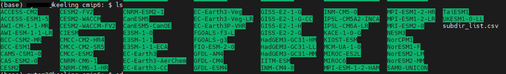

# Create a Catalog of Model Files on Keeling with Intake-ESM

This tutorial will demonstrate how to create a catalog in the form of a pandas table with Jupyter notebook. 

Links to the sample Jupyter Notebook: 

- CESM2: (Coming Soon)
- CMIP6: [Here](../tutorials/create_catalog_cmip6.ipynb)

>Make sure you are referring to the correct notebook when building the catalog. 

This tutorial is based on the content contributed by professionals who developed intake_esm and ecgtools. Check out more details about what intake_esm is and its additional functions at their websites - [intake_esm](https://intake-esm.readthedocs.io/en/stable/how-to/build-a-catalog-from-timeseries-files.html) and [ecgtools](https://ecgtools.readthedocs.io/en/latest/how-to/use-a-custom-parser.html). 

## Prerequisites
It is required to have the packages listed as follow installed. 
   
    import intake
    from ecgtools import Builder
    from ecgtools.parsers.cesm import parse_cesm_timeseries
    import pandas as pd 
    import xarray as xr
    import numpy as np
    import itertools

- Install [`ecgtools`](https://ecgtools.readthedocs.io/en/latest/how-to/install-ecgtools.html)
- Install [`intake`](https://intake-esm.readthedocs.io/en/stable/how-to/install-intake-esm.html)

## Introduction 
The main goal of doing this step is to update the existing catalog with the newly downloaded files that are rearranged in the organized folders (e.g. `./cmip6/` and `./cesm2/`). It is most likely that there are new folders created to store the newly downloaded datasets, for example, model output for a new member of an exisiting model is downloaded; or, datasets of a new model is downloaded. 

Therefore, we would have to 
1. Get the most recent list of all subdirectories in the main folder (`cesm2` or `cmip6`)
2. Load the list into a Jupyter Notebook 
3. Create the Catalog Builder and Build the Catalog 
4. Check and Save the new catalog 

## Step 0: Get Updated List of Subdirectories 
Go to the targetted folder through the Terminal: 
- If you need to update the **CMIP6** catalog, go to `/data/keeling/a/cristi/a/data/cmip6`. 
- If you are updating the **CESM2** catalog, go to `/data/keeling/a/cristi/a/data/cesm2`. 

**CMIP6**

You should be able to see a similar scene when you reached the `./cmip6/` folder.  

Run the following line of code: 
    
    readlink -f $(find . -type d -path '*/r*' -prune) > subdir_list.csv

This is a nested code, where all subdirectories (all members within the model folders) are included, '`readlink -f`' part instructs to get the full filepath. The latter part '`> subdir_list.csv`' saves the output as a `.csv` file in the `./cmip6/` folder. 

**CESM1/CESM2** 

(To be updated)

## Step 1: Load List of all Subdirectories in `./cesm2` or `./cmip6`

    filepathlist = pd.read_csv('/data/keeling/a/cristi/a/data/cmip6/subdir_list.csv',header=None,names=['dirpaths']).values.tolist()
    
    filepath=list(itertools.chain.from_iterable(filepathlist))

> Change the filepath `./cmip6/...` to `./cesm2/...` for reading the subdirectory list file for CESM2. 

We load the `.csv` file from step 0 into the Jupyter Notebook and get all the directory paths. Since it is a pandas object, we need to change it as a list. After the first line of code, we will get a list of lists; therefore, the second line combines the list of lists and return a list with strings of directory paths. 

## Step 2: Create the Catalog Builder and Build the Catalog 

    cat_builder = Builder(paths=filepath)
    catalog = cat_builder.build(parsing_func=parse_cmip6)

The `Builder` object is used directly from [Intake_ESM](https://intake-esm.readthedocs.io/en/stable/how-to/build-a-catalog-from-timeseries-files.html), which has more detailed discussion about the arguments for `Builder`. Here, `paths` is the only argument included, which is the list of directory paths we get from step 1. 

Then, we will build the catalog with `.build()`, where the `parsing_func` is dependent on the files that the catalog includes:

- **`parse_cmip6`** for CMIP6 files 
- **`parse_cesm_timeseries`** for CESM Timeseries files*
- **`parse_cesm_history`** for CESM History files*

 *Works for both CESM1 and CESM2. 

These are the exisisting parsing functions. For files other than these types, such as CMIP5 files, you can build your own parsing function with the guidelines from [ecgtools](https://ecgtools.readthedocs.io/en/latest/how-to/use-a-custom-parser.html). To check what the parsing function is, you can run

    ?parse_cmip6

The run time for this step may be long, especially for the CMIP6 catalog, due to the large amount of files. 

## Step 3: Check and Save the Catalog

    catalog.df

The variable `catalog` is a `ecgtools.builder.Builder` object. To view the content, we add `.df` to read it as a dataframe. 

    catalog.df.to_csv('/data/keeling/a/cristi/a/data/cmip6_catalog.csv', index=False)

`index=False` is required to avoid an additional column of index when loading the catalog. 

The path for saving the catalogs is as follow: 

    /data/keeling/a/cristi/a/data/

And now you are done! 

## Resources 
1. [Intake_ESM page](https://intake-esm.readthedocs.io/en/stable/how-to/build-a-catalog-from-timeseries-files.html)
2. [ECGtools (Changing Parsers)](https://ecgtools.readthedocs.io/en/latest/how-to/use-a-custom-parser.html)
