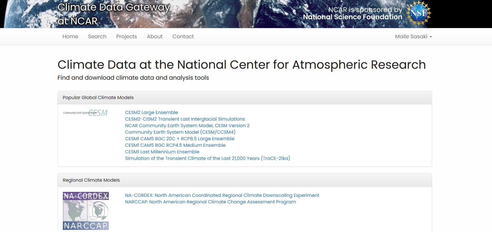
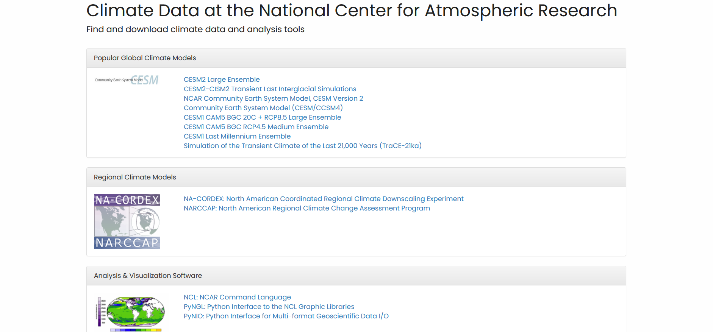
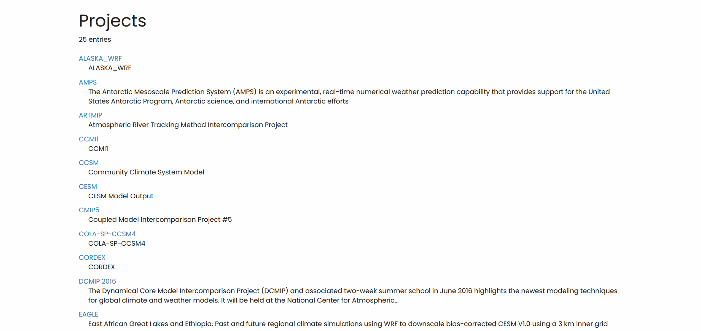
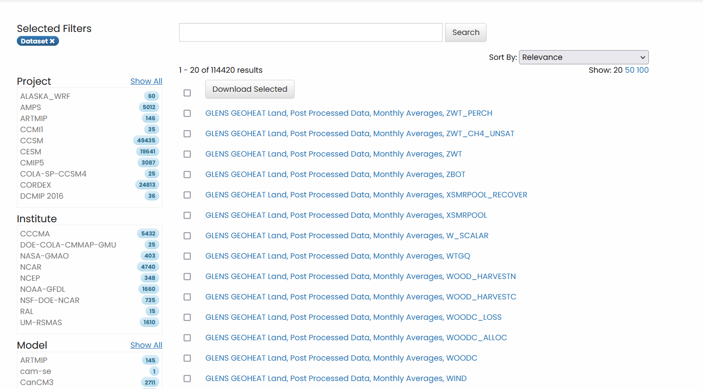

# Downloading CESM Data from the NCAR Website

This tutorial will go through the different steps of downloading CESM data on to Keeling from the NCAR website. This tutorial is fairly similar to the one used to [download CMIP5 and CMIP6 data](./downloading_CMIP5_and_CMIP6_Models_.nc_Files_from_ESGF.md), although a little simpler.

Publicly available datasets like the CESM large ensemble and the CESM1 last millenium ensemble can be accessed [here](https://www.earthsystemgrid.org/), which is where our tutorial will start.

## Step 0: Create an NCAR Account (You can skip if you already have one)

Click on the Sign in button on the top right of the home screen. You'll be asked if you want to sign in with ORCid,..., or create an NCAR account. 

ORCid has had issues in the past, so it would be suggested to use an NCAR account, since it's fairly simple to set up. 

After creating an account, you can sign in and start downloading data!

## Step 1: Find datasets

There's several different ways to access the different datasets on earthsystemgrid.org, but mostly you'll want to start by searching for the specific project that you'd like data from.

### Method 1a: Searching from the homepage

The homepage has several key NCAR projects that you may want to look into before doing a detailed search. Clicking on one of those links will take you to a page that details specifics
about the project, contact information, related articles, and more. You'll also be typically given either child datasets to look at and download, or a button that will take you to 
download options.

### Method 1b: Searching through the Projects tab

Clicking on the Projects tab will take you to a directory of different models and projects, like CMIP5 and CCSM. Each of these links will take you to the search tab with the selected 
project or model highlighted. This may help simplify your search.

### Method 1c: Using the Search tab

You can also use the filters on the left in order to find the specific model data you need.
This separates the data by:
 - **Project**
   - e.g. CMIP5, ALASKA_WRF, CESM
 - **Institute**
   - e.g. NCAR, NASA-GMAO
 - **Model**
   - e.g. CESM, CanCM3
 - **Experiment** 
   - e.g. 19790101, 19790201
 - **Frequency**
   - e.g. Daily, 3-Hourly, Annual Average
 - **Product**
   - e.g. hist, proc, verif
 - **Realm**
   - e.g. aerosol, atmos, land
 - **CF Variable**
   - e.g. 10-m wind, HDO snow ice
 - **Variable Name**
   - e.g. a2x1d_Faxa_dstwet2
 - **Ensemble**
   - e.g. r0i0p0, r13i1p1
 - **Publisher**
   - e.g. UCAR/NCAR
