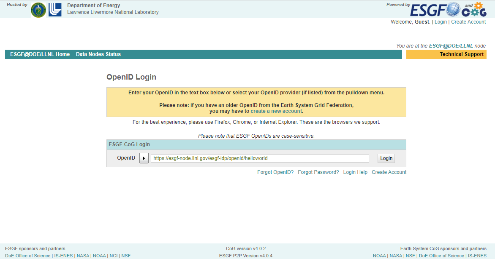

# Downloading CMIP5 and CMIP6 Models .nc Files from ESGF

This tutorial is applicable to downloading both CMIP5 and CMIP6 model output, and will cover on downloading from [Earth System Grid Federation (ESGF)](https://esgf-node.llnl.gov/search/cmip6/). 

This is aimed to serve as a quick guide to download global model output. For any other questions, please see the [detailed ESGF guide](https://esgf.github.io/esgf-user-support/user_guide.html?highlight=open%20id), or reach out to fellow folks working with CMIP output (at UIUC or the developers at LLNL). Please take any suggestions provided in this guide as a grain of salt. 

--------

## Step 0: Create ESGF Account (Skip if already has ESGF OpenID)
It is required to have an account at ESGF to start downloading files. To access files on ESGF through your account, Open ID is what you need. It is a string that looks like a hyperlink/website. 

`https://esgf-node.llnl.gov/esgf-idp/openid/helloworld`

Create a new profile if you don't already have one by filling out all boxes that are bolded. 

>**Important:** Remember to record Open ID, as it will be used for ESGF account future log-ins and authentication when downloading the data. 

If you requsted forgot OpenID, you will receive an email with an attachment of your username as filename. Open that in any text reader (e.g. notepad). The OpenID is the long string in the bracket 'Local ID'. 

------

## Step 1: Login to ESGF Node
To log in, click 'Login' on the upper right corner, and you should reach a page that requests your Open ID. 

Once you input your openID, you will get redirected to this page that asks for your username and password (either one of the following). The username is embedded as part of your OpenID (`helloworld` from the above example).

You will get redirected to the homepage of ESGF once you successfully logged in. 

--------

## Step 2: Use the filters on the left panel to get all your files

>If you are at the homepage of the ESGF node, click `'More search options'` to get to the page where the magic happens. 

It is hard to pinpoint the specific filenames of the specific models/experiments/realizations. Thus, we will narrow down our search through selecting the conditions that we want.

>Note: CMIP6 output has another search interface. Make sure you are at the correct page when searching for [CMIP5](https://esgf-node.llnl.gov/search/cmip5/) or [CMIP6](https://esgf-node.llnl.gov/search/cmip6/) output.

The more important and commonly things to select are (CMIP6/5): 

- **Source ID/ Model**: 
    - e.g. CESM2, CESM1-1-CAM5-CMIP5 
- **Experiment ID/ Experiment**: 
    - e.g. amip, abrupt-4xCO2
- **Variant Label/ Ensemble**: 
    - e.g. r1i1p1f1
- **Table ID/ CMIP Table**: 
    - e.g. Amon
- **Frequency/ Time Frequency**: 
    - e.g. mon (i.e. monthly)
- **Variable**: 
    - e.g. `ta` (air temperature), `hus` (specific humidity), `hur` (relative humidity), `ua` (eastward wind), `va` (westward wind) 

If you are downloading a single `.nc` file, see Step 3. 

Once you found the dataset that you want from the results, click '`add to data cart`' if you are downloading multiple files. 

  

## FAQ and Tips when narrowing down files to download: 
 

1. **There are similar modelnames with different suffix. How to select which models to download?**
    
    If you are trying to replicate the results from a published paper, choose the identical ones from the list of specific models they use in the supplementary information (or reach out to the authors for their list of models). 

    Otherwise, go for the one with the most serach result in the database, as indicated by the numbers followed by the model name in the filter box. (TB-revised)

2. **Which experiment should I choose?**

    Experiments are sorted by big umbrella terms including (but not limited to) amip, aburpt-4xCO2 and historical. There are sub-experiments developed from the various modelling centers and intercomparison projects, such as `amip-hist` from `amip`, `historical` and `abrupt-4xCO2` from `piControl`, and the SSP-based RCP scenario `ssp585` from `historical` experiment. You can simply select the big experiments to include all when searching. 

    Links to detailed documentation of various experiments and their relationships: 
    - [amip](https://view.es-doc.org/?renderMethod=name&project=cmip6&type=cim.2.designing.NumericalExperiment&client=esdoc-url-rewrite&name=amip)
    - [piControl](https://view.es-doc.org/?renderMethod=name&project=cmip6&type=cim.2.designing.NumericalExperiment&client=esdoc-url-rewrite&name=picontrol)
    - [historical](https://view.es-doc.org/index.html?renderMethod=id&project=cmip6&id=713f15b6-e289-44e9-ba74-0d0e827e42ac&version=1)
    - [abrupt-4xCO2](https://view.es-doc.org/index.html?renderMethod=id&project=cmip6&id=b67e8d2f-93fc-41d9-91d8-420eac7b0052&version=1)

    For other experiments, simply google the experiment name and the terms '`es-doc`' and '`cmip6`' for the documentation.
    
3. **What are the variant labels?**

    Variant labels contain `r`,`i`,`p`,`f`, standing for the four indices, `realization`, `initialization`, `physics` and `forcing` respectively. They are used to distinguish individual members of an ensemble. Details of each indices are recorded in the ES-DOC. 

    The most commonly used one is `r1i1p1f1`, but not all models include this variant. See 5 of FAQ for more details on what to do if `r1i1p1f1` is not available. 
    
    Check out the [UKESM page](https://ukesm.ac.uk/cmip6/variant-id/) and the 'Individual members of an ensemble' paragraph under section 8 of the [CMIP6 Participation Guidance for Modelers](https://pcmdi.llnl.gov/CMIP6/Guide/modelers.html) on variant labels. 

4. **I don't know the short form of the variables. How should I choose?**
    
    Under `Variable`, the variables are referred by their output variable name (short form, e.g. `tas`), instead of the commonly known CF standard_name (descriptive name, e.g. `air_temperature`). To look up the variable name or what different variables stand for (e.g. `ta`, `ts` and `tas`), you can search within this [website](https://pcmdi.llnl.gov/mips/cmip3/variableList.html) that includes the long list of variables. 

    > It is possible that CMIP5 and CMIP6 have different names for the same variable. 

5. **The search returned zero results. What to do now?**

     0. Double check you selected the correct combination of conditions. 
     
     1. Click `show all replicas` under the search bar.

        
        
        It is possible that the LLNL ESGF node doesn't have the file that you are looking for. By clicking show all replicas, file of the same name from other data nodes like the one in UK (`esgf.ceda.ac.uk`),or AU (`esgf.nci.org.au`) will show. 
        
        If there are more than one identical results, cross check if they are the identical, then simply select the one that matches with what you are looking for. 
     
     2. Relax your search conditions. 
        
        These following may not be labelled to the targetted files, and thus may not show when doing the search. (They are also less critical to pinpoint the targetted files.)

        - **Table ID**: Remove the Table ID. 
        - **Frequency**: Remove Frequency (e.g. mon). 
    
        - **Variant Labels**:
            
            If `r1i1p1f1` is not available in the search, grain-of-salt suggestion is to select all variant labels that has prefix `r1i1p1f` as substitution, i.e. use ensemble members of the same realization, initial conditions and physics, but different forcings.  *****(TB revised)
    

6. **General Tips to do less work when searching**

    - **You don't really need to select from all boxes(CMIP6/CMIP5)**
    
       Either they are a very big set that encompasses too much files, thus not really helpful in narrowing down the search; or are somewhat duplicative of other conditions (e.g. `Institute` is covered by the specific model name): 
        
        - Activity*
        - Product
        - Institution ID/Institute
        - Source Type*
        - Table ID*
        - Realm 
        - CF Standard Name
        - Experiment Family# 
        - Variable Long Name 

        *Only in CMIP6 search interface 

        #Only in CMIP5 search interface 

    - **CMIP5: Need not to select variables when narrowing search**
        
        CMIP5 datafiles are bundled together as one Dataset: i.e. There are multiple variables in one `.gn` dataset. You can select multiple model names in one search and get all the needed datasets in a couple searches. 
        
        
        To select the variables to be downloaded after adding all the datasets to the Data cart, search the variable names in the '`enter text`' box (see Step 3 for details).  
        
    - **CMIP6: Select all variables needed for one models in a single search**

        Opposite from CMIP5, a dataset listing in CMIP6 database represents a single variable. Instead of selecting multiple models in one search, select multiple variables within the search for a single model. If lucky, you should be able to get all the needed files for `n` times, where `n` is the number of models.

    - **Number of files under `List Files` in the Dataset may be more than 1**

       You can check the filenames by clicking `List Files` in the `Full Dataset Services`. For CMIP5, this may not be a surprise as all variables from that model are bundled as a single dataset. However, variable files may be broken down into more than one single file within the time period in both CMIP5 and CMIP6. For example, AMIP experiments that last from 1979 to 2014 may be broken into 6 files for each 5-year interval. 

       This is helpful when deciding your download method - whether you want to download a single `.nc` file, or the full dataset. It may also be useful when checking if you have missed any files or not.  
        
  
        
----------

# Step 3: Downloading the Datasets/Files 

Once you found the dataset(s) you needed, you can proceed to download the dataset. 

## 0. (CMIP5-WGET Script Method Only) Filter Variables 
 

> Make sure there is only CMIP5 or CMIP6 datasets in your Data Cart. Although CMIP5 and CMIP6 have different search interface, they share the same Data Cart.

- Since CMIP5 datasets have all variables bundled together, downloading the entire datasets takes up a lot of memory. Out of the multiple variables, you may only need to use a few. 

    

    Now that there is only CMIP5 datasets in your data cart, you can select the variables to download by typing the variable names in the box on the upper right and click apply as shown in the red box. 

    

    In this example, `ts`,`hur`, `uas` and `vas` are selected to download. To check whether the filter is applied, click '`Show Files`' to see if the number of files under the dataset has changed: Only 4 files under the `MPI-ESM-LR` dataset and 7 files from `MRI-CGCM3` will be downloaded, instead of the total 53 and 83 files.

  

## 1. Downloading Batch of Datasets

- **Method 1a: WGET Script Download**

    Go to '`My Data Cart`'. There should be all the datasets that you selected from the filter search from Step 2.   

    

    Click '`Select All Datasets`', then click '`WGET Script`' under '`Collective Services for All Selected Datasets`'. You will see links to download the WGET script. The number of script links depends on the amount of nodes the datasets are downloaded from. In this example, not all datasets are available in the LLNL-ESGF node, and replicas from the AU and UK nodes are selected. Therefore, datasets will be acquired from all LLNL-ESGF, AU-ESGF and UK-ESGF nodes, so we'll need to download total of three scripts. 
    
    

    When you click the link, you may see the information not secure page. Click '`Send anyways`'. 

    

    The bash script will be downloaded to your local computer. Use `scp` to copy/transfer the script to your targetted file destination on Keeling. Run the script as follow, where `wget-20221226003827.sh` is the script name.

        bash wget-20221226003827.sh

    The script name can be replaced with `*.sh` to run multiple WGET scripts, assuming all the scripts are in the same directory. 

    You will get prompted for the OpenID and the Passphrase as seen in the red box. Paste the entire OpenID to the prompt, and type the same password when logging into the WCRP CMIP5/6 search interface. The download will start instantly. The prompt will return `Connected` as underlined in blue to indicate a successful download. 

    

  
- **Method 1b: Globus Download to Keeling** 
    
    *Not all files has the Globus Download Option. 

    

    Under the `Full Dataset Service`, select `Globus Download`. You will get redirected to a page that lists all the Globus paths of the files. 

    

    There are two options to download the files with the Globus method. 
    
    **I. Website Method**
    Once you click `Start Web Download`, you will get redirected to the Globus file manager. Login with your .illinois account credentials.

    

    Once you reach the Globus file manager dashboard, click the `Search` box in Collection, and then select `sese#keeling-dtn`. 

    

    You will then see your Keeling account. Select the file destination on Keeling, then click '`Submit`'.  

    

    If you are on Google Chrome, you may see this page displayed. Simply click `Send Anyways`. 

    

    You will get redirected to the WCRP ESGF page once the transfer is done with the following confirmation message shown. You may also receive an email from Globus confirming the download task. 

    

    You should be able to see the files in your destination folder on Keeling. 

    **II. Download Python Script**
    
    Click '`Start Script Download`' in Option 2. The `.py` will then download to your local computer. Similar to `WGET Script`, upload the python script to Keeling and run it as a regular python script. Then use `mv` to move the files to the destined folder. 

  

## 2. Downloading a Single Variable `.nc` File
> If you are trying to download a single variable, but the number of files != 1, it is highly recommended to use the methods mentioned in `1. Downloading multiple datasets`. 

-  **Method 2a: HTTP Download** (need testing - I always fail this on my comp)
    
    In the Dataset listing, select `List Files` from `Full Dataset Services`. This should expand the full list of `.nc` files under the dataset. On the right hand side of the file listing, there are multiple links under `Single File Access`.  

    

    Click HTTP Download, and the file should be downloaded to your local computer. Use `scp` to upload the file to Keeling from your local terminal.
    
     

- **Method 2b: Globus Download** (I can't do this either)

    

     

    

